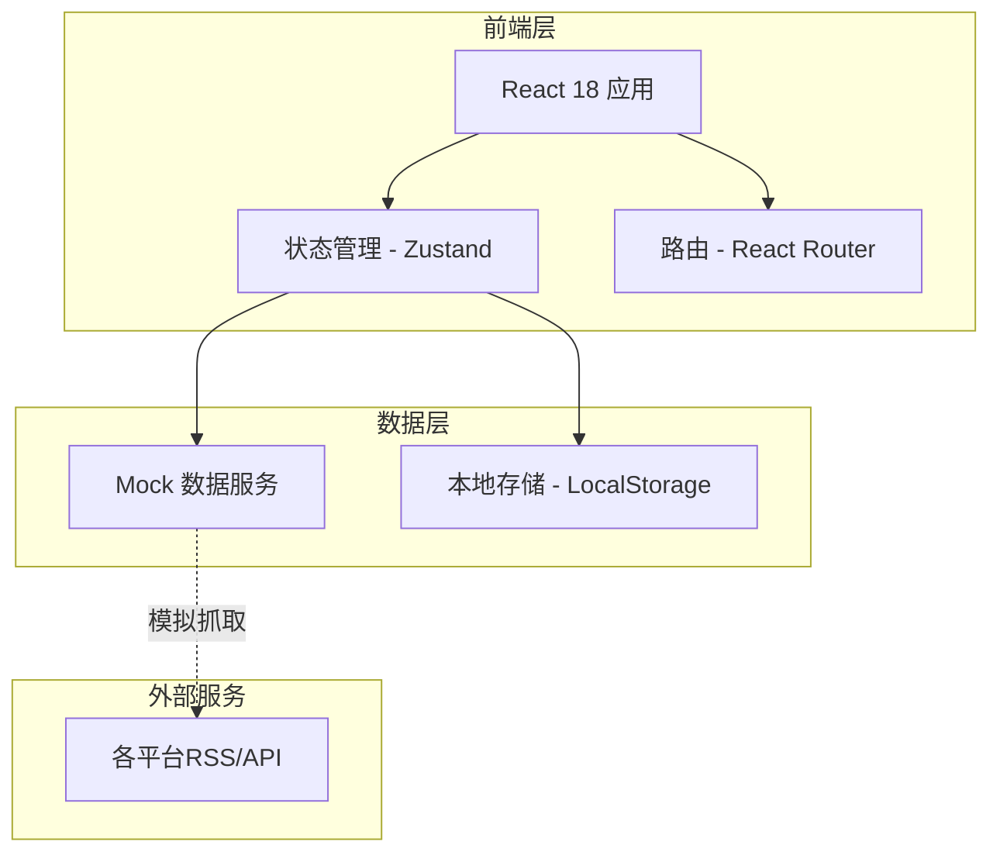

## 1. 架构设计



## 2. 技术说明

- **前端框架**: React@18 + TypeScript + Vite
- **样式方案**: Tailwind CSS@3 + CSS Modules（复杂动画）
- **状态管理**: Zustand（轻量级全局状态）
- **路由**: React Router@6
- **动画库**: Framer Motion
- **图标**: Lucide React + 自定义平台SVG
- **数据源**: Mock数据模拟（实际项目需对接各平台API/RSS）
- **构建工具**: Vite

## 3. 路由定义

| 路由 | 用途 |
|------|------|
| `/` | 首页 - 平台导航与热点瀑布流 |
| `/detail/:id` | 详情页 - 热点内容预览 |
| `/favorites` | 收藏页 - 本地收藏列表 |

## 4. 数据模型

### 4.1 热点数据模型

```typescript
interface NewsItem {
  id: string;
  title: string;
  summary: string;
  source: Platform;
  sourceIcon: string;
  sourceColor: string;
  publishTime: Date;
  hotScore: number;
  imageUrl?: string;
  originalUrl: string;
  tags: string[];
}

type Platform = 
  | 'bilibili'
  | 'weibo'
  | 'zhihu'
  | 'github'
  | 'juejin'
  | 'douyin'
  | '36kr'
  | 'ithome'
  | 'segmentfault'
  | 'oschina'
  | 'infoq'
  | 'ruanyifeng'
  | 'csdn'
  | 'stcn'
  | 'caixin'
  | 'all';

interface PlatformConfig {
  id: Platform;
  name: string;
  icon: string;
  color: string;
  category: 'video' | 'social' | 'tech' | 'finance' | 'news';
}
```

### 4.2 平台配置数据

```typescript
const platforms: PlatformConfig[] = [
  { id: 'bilibili', name: '哔哩哔哩', icon: 'bilibili', color: '#00A1D6', category: 'video' },
  { id: 'weibo', name: '微博', icon: 'weibo', color: '#E6162D', category: 'social' },
  { id: 'zhihu', name: '知乎', icon: 'zhihu', color: '#0084FF', category: 'social' },
  { id: 'github', name: 'GitHub', icon: 'github', color: '#24292F', category: 'tech' },
  { id: 'juejin', name: '掘金', icon: 'juejin', color: '#1E80FF', category: 'tech' },
  { id: 'douyin', name: '抖音', icon: 'douyin', color: '#000000', category: 'video' },
  { id: '36kr', name: '36氪', icon: '36kr', color: '#0080FF', category: 'news' },
  { id: 'ithome', name: 'IT之家', icon: 'ithome', color: '#D32F2F', category: 'tech' },
  { id: 'segmentfault', name: '思否', icon: 'segmentfault', color: '#009A61', category: 'tech' },
  { id: 'oschina', name: '开源中国', icon: 'oschina', color: '#009688', category: 'tech' },
  { id: 'infoq', name: 'InfoQ', icon: 'infoq', color: '#007DC5', category: 'tech' },
  { id: 'ruanyifeng', name: '阮一峰博客', icon: 'ruanyifeng', color: '#E91E63', category: 'tech' },
  { id: 'csdn', name: 'CSDN', icon: 'csdn', color: '#FC5531', category: 'tech' },
  { id: 'stcn', name: '证券时报', icon: 'stcn', color: '#C62828', category: 'finance' },
  { id: 'caixin', name: '财新网', icon: 'caixin', color: '#8B0000', category: 'finance' },
];
```

## 5. 目录结构

```
src/
├── components/
│   ├── layout/
│   │   ├── Header.tsx
│   │   ├── Sidebar.tsx
│   │   └── Layout.tsx
│   ├── news/
│   │   ├── NewsCard.tsx
│   │   ├── NewsGrid.tsx
│   │   └── PlatformTabs.tsx
│   └── ui/
│       ├── Button.tsx
│       ├── SearchBar.tsx
│       └── LoadingSkeleton.tsx
├── pages/
│   ├── Home.tsx
│   ├── Detail.tsx
│   └── Favorites.tsx
├── stores/
│   ├── newsStore.ts
│   └── favoritesStore.ts
├── data/
│   ├── mockNews.ts
│   └── platforms.ts
├── hooks/
│   ├── useNews.ts
│   └── useLocalStorage.ts
├── types/
│   └── index.ts
├── utils/
│   ├── formatters.ts
│   └── constants.ts
├── App.tsx
├── main.tsx
└── index.css
```

## 6. 性能优化策略

- **虚拟滚动**: 使用 react-virtualized 处理大量热点列表
- **图片懒加载**: Intersection Observer 实现图片按需加载
- **请求缓存**: 对 Mock 数据实现内存缓存，避免重复请求
- **代码分割**: 路由级别懒加载，减少首屏加载体积
- **骨架屏**: 加载时展示骨架屏，提升感知性能
